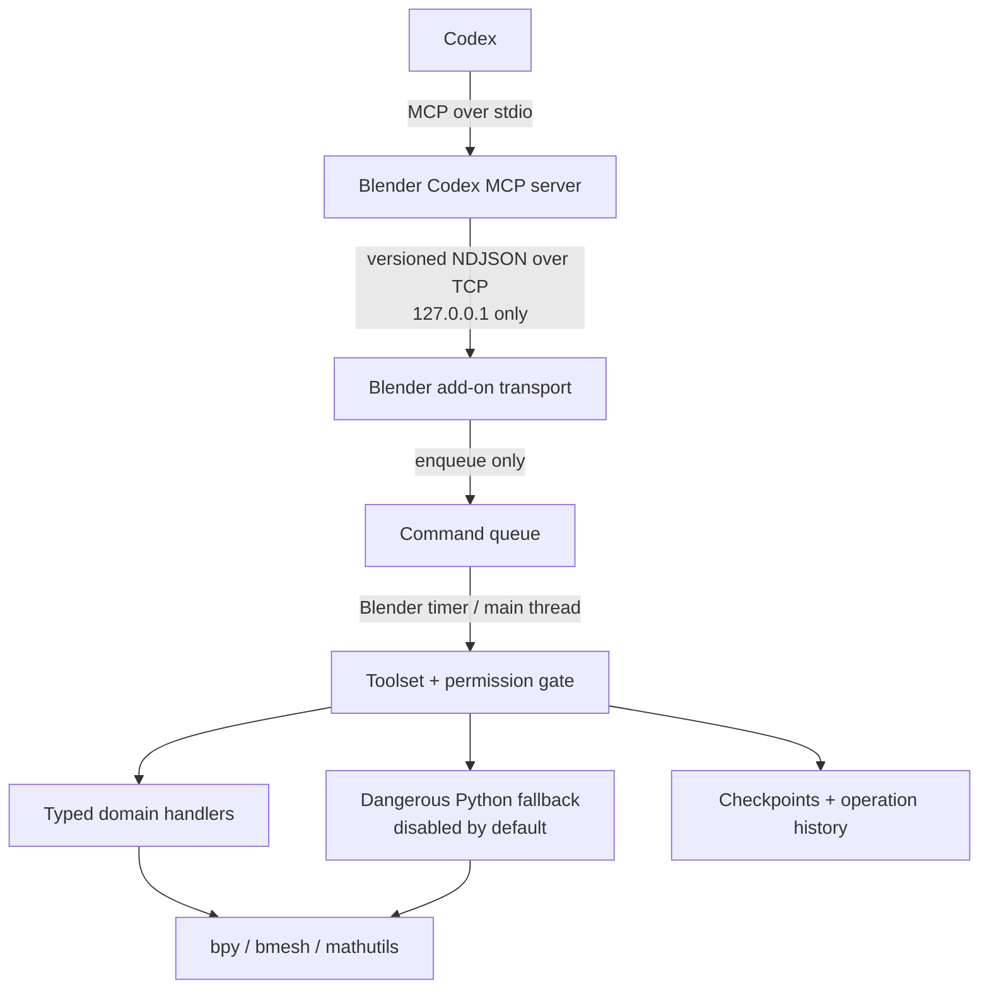

# Blender Codex Bridge

Blender Codex Bridge is a local Blender add-on, MCP server, and Codex plugin package for inspecting and editing a live `.blend` through permission-gated tools. It is built around a human-style loop:

```text
understand -> plan -> checkpoint -> act -> verify structurally
-> verify visually -> compare -> refine -> save only when requested -> report
```

Release `0.2.0` is an alpha platform, not a finished replacement for every Blender editor. The current registry contains **89 Blender-side methods** and **88 remotely callable MCP tools**; `checkpoint.restore_last` is intentionally available only from Blender's local recovery UI. Common workflows have structured tools. Long-tail Blender API work can use the dangerous, disabled-by-default `python.execute` fallback when the user explicitly enables and acknowledges it.

Use copies or normal versioned backups for important projects. A checkpoint is Blender session undo state, not a durable branch.

## What is implemented

The running `toolsets.list` result is authoritative. In `0.2.0`, the registered surface is:

| Surface | Count | Current coverage |
| --- | ---: | --- |
| Core | 16 MCP tools | Status, current task, project/scene/selection/object inspection, viewport capture, checkpoints, save, and toolset controls |
| Objects | 11 | Primitive/object creation, deletion, duplication, rename, parenting, collections, and transforms |
| Mesh | 8 | Arbitrary mesh creation from bounded vertices/edges/faces, bounded inspection, and selection-scoped normals/delete/dissolve/extrude/inset/bevel |
| Materials | 8 | Inspect, create/delete, assign/unassign, slot lifecycle, and Principled inputs |
| Material nodes | 7 | Bounded shader graph inspection; add/remove/rename nodes; set inputs; link/unlink sockets |
| UV | 4 | Layer/island inspection, unwrap, Smart Project, and island packing |
| Modifiers | 5 | Inspect, add, set allowlisted properties, remove, and apply |
| Object constraints | 4 | Inspect, add, set allowlisted properties, and remove |
| Animation | 5 | Action/F-curve/keyframe inspection, frame/range settings, key insertion/deletion |
| Rigging | 9 | Armature inspection/creation, bone lifecycle, pose transforms, pose constraints, and mesh binding |
| Scene editing | 7 | Scene configuration, collection lifecycle, cameras, lights, and world background |
| Render | 3 | Inspect, configure, and execute still renders to managed or approved local paths |
| Python fallback | 1 | Explicitly acknowledged Blender Python for unsupported long-tail work |

This is broad coverage, but it does **not** mean every Blender operation has a dedicated structured tool. Geometry Nodes graph editing, compositor graphs, advanced sculpting/painting, simulations, NLA editing, detailed weight painting, retopology, baking, and many specialist operators still need additional structured handlers or the last-resort Python path.

## Architecture



The MCP process never imports `bpy`. Network threads only frame and enqueue requests; Blender API access runs serially on Blender's main thread. Blender-side permissions are authoritative, and the listener accepts only the literal IPv4 loopback address `127.0.0.1`.

See [architecture](docs/architecture.md), [protocol](docs/protocol.md), [security](docs/security.md), and [tool design](docs/tool-design.md) for the detailed contracts.

## Requirements

- Blender 4.2 LTS or newer; 4.2 is the compatibility baseline.
- Python 3.10+ for the standalone MCP server.
- A local Codex client with MCP/plugin support.
- A desktop Blender session for normal viewport capture. Headless mode supports the documented camera-render fallback only.

Blender bundles its own Python. Install the MCP package in a normal virtual environment, not into Blender's bundled interpreter.

## Install from source

```powershell
git clone https://github.com/Yoruiopz/Codex-Blender-Bridge.git
cd Codex-Blender-Bridge
py -3.10 -m venv .venv
.\.venv\Scripts\Activate.ps1
python -m pip install -e .
```

On macOS/Linux, activate with `source .venv/bin/activate`. Contributors can install `python -m pip install -e ".[dev]"`.

The editable install provides the required `blender-codex-mcp` console script. Confirm the same environment can find it:

```powershell
Get-Command blender-codex-mcp
blender-codex-mcp --help
```

### Build and install the Blender add-on

```powershell
python .\scripts\build_addon.py
```

The builder validates the archive layout and writes:

```text
dist/blender_codex_bridge-0.2.0.zip
```

Install that ZIP in Blender:

1. Open **Edit > Preferences > Add-ons**.
2. Choose **Install from Disk...** and select the `0.2.0` ZIP.
3. Enable **Blender Codex Bridge**.
4. Open a 3D Viewport, press `N`, then open **Codex Bridge**.
5. Review the permission toggles and start the bridge on `127.0.0.1:9876`.

The archive must contain `blender_codex_bridge/__init__.py` at its root. Do not ZIP the whole repository.

## Connect Codex

### Repository plugin package

The first-class Codex plugin is at [`plugins/blender-codex-bridge`](plugins/blender-codex-bridge). It bundles:

- a plugin manifest;
- MCP configuration that starts `blender-codex-mcp --transport stdio` and connects to `127.0.0.1:9876`;
- a Blender workflow skill that teaches the inspect/checkpoint/verify loop;
- a read-only doctor script.

Install or enable that directory with Codex's local plugin workflow. The plugin does not bundle a Python runtime, so install this repository first and ensure `blender-codex-mcp` is on the environment `PATH` visible to Codex. Then install the Blender add-on ZIP and start its listener.

### Manual MCP registration

From the repository root on Windows:

```powershell
codex mcp add blender_codex_bridge -- .\.venv\Scripts\blender-codex-mcp.exe
codex mcp list
```

Or use a project/user Codex configuration with absolute paths:

```toml
[mcp_servers.blender_codex_bridge]
command = "E:\\Projects\\Codex-Blender-Bridge\\.venv\\Scripts\\blender-codex-mcp.exe"
cwd = "E:\\Projects\\Codex-Blender-Bridge"
startup_timeout_sec = 20
tool_timeout_sec = 120
enabled = true

[mcp_servers.blender_codex_bridge.env]
BLENDER_CODEX_BRIDGE_HOST = "127.0.0.1"
BLENDER_CODEX_BRIDGE_PORT = "9876"
```

The standalone server also supports:

```powershell
blender-codex-mcp --transport stdio --blender-port 9877 --timeout 45
```

The add-on and MCP server must use the same literal loopback host and port. See the official [Codex MCP documentation](https://developers.openai.com/codex/mcp/) for current client configuration behavior.

## Blender sidebar

The **Codex Bridge** sidebar is the user's live control surface. It shows:

- listener/client status, protocol and add-on versions, current method, and queue depth;
- editable local host, port, and request timeout;
- start, stop, pause/resume, and emergency-stop controls;
- the high-level task set by `bridge.task.set` and cleared by `bridge.task.clear`;
- every toolset with its enabled state and tool count, plus **Enable Structured** and **Core Only** controls;
- all Blender-side permissions, with warnings for dangerous Python and external-file access;
- bounded success/failure history, duration, affected objects, and last error;
- copy-diagnostics and clear-history actions;
- checkpoint creation, one-step global undo, and local restore controls with confirmation.

Toolset enablement reduces reach and schema load; it does not grant a permission. Pause blocks mutations while leaving inspection available. Emergency stop also stops the listener and cancels queued work that has not started.

## Permissions

| Permission | Governs | Default in add-on preferences |
| --- | --- | --- |
| `INSPECT_SCENE` | Project, scene, object, material, animation, rig, UV, modifier, constraint, and render reads | on |
| `CAPTURE_VIEWPORT` | Viewport/camera captures and render-result replacement | on |
| `TRANSFORM_OBJECTS` | Object lifecycle/transforms, modifiers, object constraints, and some rig operations | on |
| `EDIT_MESH` | Mesh and UV mutations | on |
| `EDIT_MATERIALS` | Material lifecycle, Principled settings, and shader nodes | on |
| `EDIT_ANIMATION` | Frame/range, keys, armatures, bones, pose, and rig constraints | on |
| `EDIT_SCENE` | Scene, collection, camera, light, and world settings | on |
| `EDIT_RENDER` | Render configuration and execution | on |
| `DELETE_OBJECTS` | Explicit object/data, material, collection, and bone deletion paths | off |
| `EXECUTE_PYTHON` | Dangerous `python.execute` fallback; combined with deletion, external-file, and save permission for every call | off |
| `ACCESS_EXTERNAL_FILES` | User-chosen save/render paths outside managed artifacts | off |
| `SAVE_PROJECT` | Save the current project | on |

Some operations require more than one permission. `mesh.create` requires `EDIT_MESH` and `TRANSFORM_OBJECTS`. `render.execute` requires `EDIT_RENDER` and `CAPTURE_VIEWPORT`; an explicit output path additionally checks `ACCESS_EXTERNAL_FILES`. The Blender executor checks current permissions immediately before the handler runs.

`python.execute` is a deliberate super-permission exception. Every call requires **all four** of `EXECUTE_PYTHON`, `DELETE_OBJECTS`, `ACCESS_EXTERNAL_FILES`, and `SAVE_PROJECT`. Once armed, raw `bpy` can modify domains, delete data, access Blender file APIs, and save without passing the normal structured `EDIT_MESH`, `EDIT_MATERIALS`, `EDIT_ANIMATION`, `EDIT_SCENE`, or `EDIT_RENDER` gates. The four-toggle requirement makes that bypass explicit; it does not make Python safe.

## Recommended first connection

1. Open the target `.blend` and start the Blender bridge.
2. Leave the optional toolsets disabled initially. Leave deletion, external files, and Python off unless the task requires them.
3. Ask Codex: `Check bridge status, set the current task, summarize the scene, and inspect my selection. Do not modify anything.`
4. Enable only the structured toolsets and permissions needed for the requested work.
5. For each meaningful change, checkpoint once, act, reinspect every affected data block, and capture a matched view when appearance matters.
6. Clear the task when finished. Save only when requested or agreed.

Typical sequences:

```text
bridge.status -> bridge.task.set -> scene.summary -> selection.inspect

checkpoint.create -> mesh.create -> object.inspect -> viewport.capture

material.inspect -> checkpoint.create -> material.set_principled
-> material.inspect -> viewport.capture

selection.inspect -> uv.inspect -> checkpoint.create -> uv.unwrap
-> uv.inspect -> viewport.capture

rig.inspect -> checkpoint.create -> rig.bone_add -> rig.inspect

render.inspect -> checkpoint.create -> render.configure
-> render.inspect -> render.execute
```

## Python fallback

`python.execute` is the long-tail coverage layer for Blender-domain operations that do not yet have a mature structured wrapper. Its provided `bpy`, `bmesh`, and `mathutils` access can reach ordinary Blender data and operators under the safe-import/AST policy, without pretending that each such operation has a dedicated, production-hardened tool. It is not the normal workflow and cannot import arbitrary third-party/process/network modules.

To run, all of the following are required:

- the `python` toolset is explicitly enabled;
- Blender's `EXECUTE_PYTHON`, `DELETE_OBJECTS`, `ACCESS_EXTERNAL_FILES`, and `SAVE_PROJECT` permissions are all explicitly enabled;
- the call includes `confirm_dangerous=true`;
- the call includes a non-empty `expected_effect` for history/audit;
- code and inputs pass size/complexity checks and the import policy.

The execution namespace provides `bpy`, JSON-safe `inputs`, bounded `print`, and a JSON-serialized `result`. Imports are limited to `bpy`, `bmesh`, `mathutils`, `math`, `json`, `collections`, `functools`, `itertools`, `random`, and `statistics`; obvious filesystem, process, network, dynamic-code, and double-underscore introspection paths are rejected. Source and captured stdout are each capped at 64 KiB. Result conversion has a global 4,000-item budget, maximum depth 8, a 4,000-digit integer guard, rejection of cyclic or shared container references before they can expand, and a separate 256 KiB serialized cap. A result that exceeds any graph/scalar/byte budget is replaced by explicit `{"__truncated__": true, ...}` metadata and reported with `result_truncated: true`, `result_bytes: null`, and `result_limit_bytes: 262144`. Any unexpected post-execution result-conversion or size-check failure degrades to the same bounded placeholder instead of escaping the audit/recovery response. A cooperative 0.1-30 second deadline is enforced, although long Blender C calls cannot always be preempted.

This policy prevents common accidents; **it is not a security sandbox**. Enabling Python means trusting the caller with broad access to the open Blender project and accepting that raw `bpy` bypasses normal structured edit permissions. The bridge does not provide shell or network tooling.

Every successful result returns `verification_required: true`. If execution starts and then fails or reaches its cooperative deadline, the structured error still includes the script digest, expected effect, duration/stdout, coarse data-count and object deltas, `mutation_outcome_unknown: true`, and `verification_required: true`. That failure is recorded in history as a possible mutation and finalized as a tracked Blender undo step, because code may have changed the project before failing. Reinspect first; only then decide whether to use confirmed global undo. Disable the Python toolset and restore all four high-risk toggles to least privilege after the exceptional operation.

## Security and limitations

- Same-host local use only. Do not bind, proxy, tunnel, or port-forward the Blender listener.
- Loopback blocks remote hosts but does not authenticate other processes running under the same local account.
- Blender execution is serial. Timeouts or disconnects after sending can leave an unknown outcome; inspect history and current state before retrying.
- Inspection results are bounded and report truncation. Images are qualitative evidence, not exact measurements.
- Desktop viewport capture needs a suitable 3D View context. Capture and render operations replace Blender's session **Render Result**.
- Checkpoints rely on global, session-sensitive Blender undo. Global undo requires explicit confirmation and can affect interleaved user work.
- Context-sensitive operators are used only where Blender requires them; mode, selection, active object, and temporary UI state are restored on a best-effort basis.
- No LAN/remote-host mode or shell tool exists.
- Unsupported structured operations must fail honestly or use the explicitly approved Python fallback; the bridge never fabricates success.

Read [security](docs/security.md) and [troubleshooting](docs/troubleshooting.md) before using the bridge on valuable work.

## Development

Run the standalone checks from the repository root:

```powershell
python -m ruff check .
python -m mypy mcp_server
python -m pytest
```

Build the add-on:

```powershell
python .\scripts\build_addon.py
```

Blender-dependent scripts are separate from the normal test suite:

```powershell
blender --background --factory-startup --python .\scripts\blender_smoke.py
blender --background --factory-startup --python .\scripts\blender_extended_smoke.py
blender --background --factory-startup --python .\scripts\blender_rig_animation_smoke.py
blender --background --factory-startup --python .\scripts\blender_uv_modifier_constraint_smoke.py
```

Repository map:

```text
addon/blender_codex_bridge/       trusted Blender add-on, UI, and handlers
mcp_server/                       standalone MCP adapter and Blender client
plugins/blender-codex-bridge/     Codex plugin manifest, MCP config, and skill
tests/                            non-Blender protocol/schema/registry tests
scripts/                          packaging and Blender smoke checks
docs/                             architecture, protocol, security, and roadmap
```

Before adding a tool, read [AGENTS.md](AGENTS.md) and [tool design](docs/tool-design.md). Before changing framing or lifecycle behavior, read [protocol](docs/protocol.md).

## License

GNU General Public License v3.0 or later. See [LICENSE](LICENSE).
