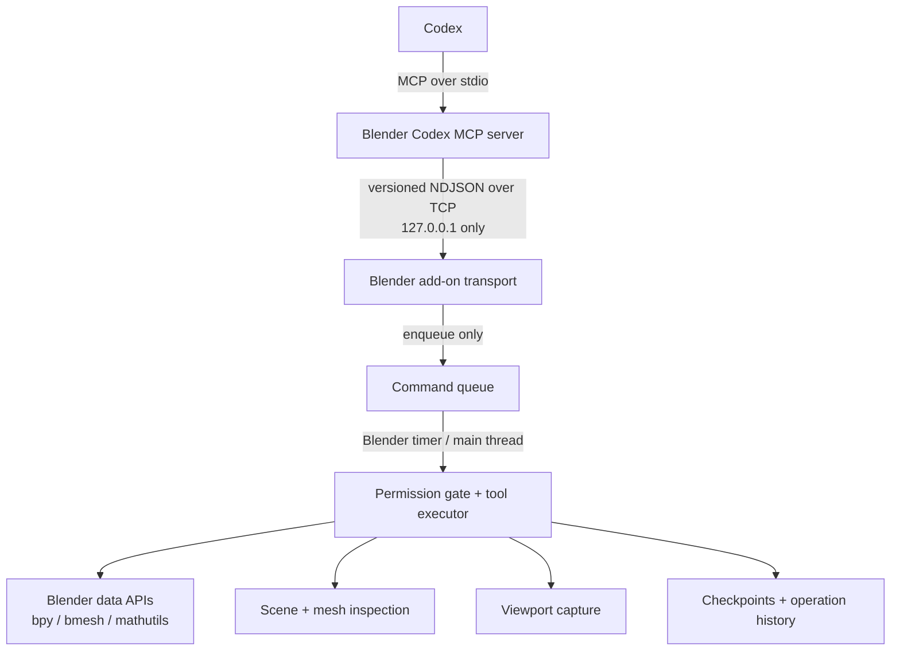

# Blender Codex Bridge

Blender Codex Bridge is a local Blender add-on and MCP server that lets Codex inspect a `.blend` project, perform permission-gated edits, and verify the result with both structured scene data and viewport images.

The project is deliberately **not** an arbitrary `bpy` socket. Codex receives a small set of typed tools; the MCP process translates those calls into a local protocol; and the Blender add-on remains the trusted authority for permissions, queuing, main-thread execution, undo, and project state.

> **Project status: early MVP.** The repository establishes the transport, inspection, permission, checkpoint, transform, and basic modeling foundations. Treat it as development software: work on a copy of important `.blend` files and check the [limitations](#current-limitations) before relying on it in production.

## Why this exists

A useful Blender agent needs two kinds of evidence:

- **Structural perception** for names, hierarchy, transforms, dimensions, mesh statistics, selection, materials, modifiers, and other measurable state. This is authoritative for facts.
- **Visual perception** for silhouette, composition, shading, materials, lighting, and qualitative review. Screenshots are evidence, not a substitute for measurements.

The intended working loop is:

```text
inspect -> plan -> checkpoint -> modify -> inspect -> capture -> compare -> refine
```

That loop is encoded for agents in [`AGENTS.md`](AGENTS.md).

## Architecture



Important boundaries:

- The MCP server does not manipulate Blender data directly.
- Network threads never mutate Blender state; they only enqueue work.
- Blender-side permissions are authoritative. MCP metadata is not a security boundary.
- The listener binds to `127.0.0.1`, not a LAN interface.
- Domain toolsets can be enabled when needed instead of exposing every future action at once.

See [`docs/architecture.md`](docs/architecture.md) and [`docs/protocol.md`](docs/protocol.md) for the component and wire-level contracts.

## Requirements

- **Blender 4.2 LTS or newer.** Blender 4.2 is the compatibility baseline. The smoke-test matrix may include newer installed releases, but compatibility claims require their checks to pass.
- **Python 3.10+** for the standalone MCP server.
- The official MCP Python SDK `mcp>=2,<3` (installed automatically with this package).
- A local Codex client with MCP support.
- A desktop Blender session for normal viewport capture. Headless Blender supports only the explicit `view="camera"`, `shading="rendered"` camera-render fallback.

Blender bundles its own Python. Do not install the MCP server's Python dependencies into Blender unless a future release explicitly requires that.

## Install from source

Clone the repository, create a virtual environment for the standalone server, and install the package:

```powershell
git clone https://github.com/Yoruiopz/Codex-Blender-Bridge.git
cd Codex-Blender-Bridge
py -3.10 -m venv .venv
.\.venv\Scripts\Activate.ps1
python -m pip install -e .
```

On macOS or Linux, activate with `source .venv/bin/activate`. Install the development extras with `python -m pip install -e ".[dev]"` when contributing.

### Build and install the add-on ZIP

Blender expects the archive to contain `blender_codex_bridge/__init__.py` at its root. Use the repository's deterministic builder:

```powershell
python .\scripts\build_addon.py
```

The default artifact is `dist/blender_codex_bridge-0.1.0.zip`. The script validates the archive layout. If you must build manually on a POSIX shell, preserve the same root directory:

```bash
cd addon
zip -r ../blender_codex_bridge.zip blender_codex_bridge
cd ..
```

Then in Blender:

1. Open **Edit > Preferences > Add-ons**.
2. Choose **Install from Disk…** and select `dist/blender_codex_bridge-0.1.0.zip`.
3. Enable **Blender Codex Bridge**.
4. Open a 3D Viewport, press `N`, and select the **Codex Bridge** tab.
5. Keep the host set to `127.0.0.1` and the default port `9876` (or choose a matching local port), then select **Start Bridge**.

For add-on development without rebuilding a ZIP, add or symlink `addon/blender_codex_bridge` into Blender's user add-ons directory. Restart Blender or reload scripts after code changes.

## Run the MCP server

Start Blender's bridge first, then run the installed MCP entry point from the activated environment:

```powershell
blender-codex-mcp
```

`python -m mcp_server` is the preferred module form (`python -m mcp_server.server` is also supported). The MCP process communicates with Codex on stdin/stdout. Do not use its stdout for ad-hoc logging; protocol-safe diagnostics belong on stderr. Its Blender-facing connection defaults to `127.0.0.1:9876`, with a 30-second tool timeout and 5-second connect timeout.

For a non-default local port, use command-line flags:

```powershell
blender-codex-mcp --blender-host 127.0.0.1 --blender-port 9877 --timeout 45
```

Equivalent environment variables are `BLENDER_CODEX_BRIDGE_HOST`, `BLENDER_CODEX_BRIDGE_PORT`, `BLENDER_CODEX_BRIDGE_TIMEOUT`, `BLENDER_CODEX_BRIDGE_CONNECT_TIMEOUT`, and `BLENDER_CODEX_BRIDGE_MAX_MESSAGE_BYTES`. Host validation rejects non-loopback addresses; keep the add-on configured to the same literal host and port.

## Configure Codex

Codex supports local MCP servers launched over stdio. You can register this one with the CLI from the repository root:

```powershell
codex mcp add blender_codex_bridge -- .\.venv\Scripts\blender-codex-mcp.exe
codex mcp list
```

Alternatively, add a project-scoped `.codex/config.toml` in a trusted project or edit `~/.codex/config.toml`:

```toml
[mcp_servers.blender_codex_bridge]
command = "E:\\Projects\\Codex-Blender-Bridge\\.venv\\Scripts\\blender-codex-mcp.exe"
cwd = "E:\\Projects\\Codex-Blender-Bridge"
startup_timeout_sec = 20
tool_timeout_sec = 120
enabled = true

[mcp_servers.blender_codex_bridge.env]
BLENDER_CODEX_BRIDGE_HOST = "127.0.0.1"
BLENDER_CODEX_BRIDGE_PORT = "9876"
```

Use absolute paths. On macOS/Linux, `command` will normally be `/absolute/path/to/.venv/bin/blender-codex-mcp`. Restart the Codex client after changing the configuration, then use `/mcp` or `codex mcp list` to confirm the server is available. See the official [Codex MCP configuration documentation](https://developers.openai.com/codex/mcp/) for current client settings.

## First connection

1. Open the `.blend` file in Blender.
2. In **Codex Bridge**, review permissions. Inspection is safe to enable first; leave deletion, external files, and arbitrary Python disabled.
3. Select **Start Bridge**.
4. Start or restart Codex so it launches the MCP server.
5. Ask Codex: `Check Blender bridge status, summarize the current scene, and inspect my selection. Do not modify anything.`
6. Confirm the add-on shows the connection and recent requests.

If the TCP connection is refused, the add-on is not listening at the same host/port as the MCP server. See [`docs/troubleshooting.md`](docs/troubleshooting.md).

## Tools and permissions

The always-available surface is intentionally compact. The MVP is organized around core tools such as:

```text
bridge.status       project.info         project.save
scene.inspect       scene.summary        selection.inspect
object.inspect      viewport.capture     checkpoint.create
checkpoint.list     checkpoint.undo_last toolsets.list
toolsets.enable     toolsets.disable
```

Additional object, transform, mesh, and material operations belong to named toolsets. The exact list reported by `toolsets.list` is authoritative for the running add-on and server version.

Each tool declares one or more Blender-side permissions, including:

```text
INSPECT_SCENE       CAPTURE_VIEWPORT      TRANSFORM_OBJECTS
EDIT_MESH          EDIT_MATERIALS        EDIT_ANIMATION
DELETE_OBJECTS     EXECUTE_PYTHON        ACCESS_EXTERNAL_FILES
SAVE_PROJECT
```

A tool being visible in Codex does not grant its permission. If Blender denies it, the operation fails with a structured `PERMISSION_DENIED` error.

## Usage examples

### Read-only inspection

> Inspect the selected object. Check its dimensions, unapplied scale, mesh statistics, modifiers, UV layers, and any obvious topology warnings. Capture a solid and wireframe view if possible. Do not change the file.

Expected tool pattern:

```text
bridge.status -> selection.inspect -> object.inspect -> viewport.capture
```

### Permission-gated transform

> Move `Key_Light` 0.5 metres upward. Create a checkpoint first, verify its resulting transform, and do not save.

Expected tool pattern:

```text
checkpoint.create -> transform.translate -> object.inspect
```

### Basic mesh repair

> For the selected mesh, checkpoint the file, recalculate normals, then reinspect it and capture the same view. Stop if the permission is denied or if the selection is ambiguous.

Expected tool pattern:

```text
selection.inspect -> checkpoint.create -> mesh.recalculate_normals
-> object.inspect -> viewport.capture
```

### Undo an agent step

> List agent checkpoints and undo the most recent logical operation. Reinspect the affected object afterward.

Checkpoint undo is recovery support, not a replacement for normal versioned backups.

## Security model

The default design is local and consent-first:

- Blender listens only on the literal loopback address `127.0.0.1`.
- Permission checks occur inside the Blender add-on for every request.
- Arbitrary Python, external file access, and remote shell execution are not part of the normal tool path. Arbitrary Python is disabled by default.
- Destructive actions such as deletion require an explicit permission.
- The MCP process should run as the same local user and never be exposed through port forwarding, a reverse proxy, or a public bind.
- Paths, if a permitted tool accepts them, must be normalized and constrained by the add-on.

Loopback is a boundary against remote hosts, not against other processes running as your local account. Do not run untrusted software alongside an active writable bridge. Read [`docs/security.md`](docs/security.md) for the threat model.

## Current limitations

This repository is a foundation for human-like Blender workflows, not a complete autonomous artist.

- Compatibility and automated tests focus on Blender 4.2+; other Blender releases may require changes.
- Blender must be running with the add-on enabled. Front/side/current, solid, wireframe, and material viewport captures require a suitable desktop 3D View context; headless/background mode supports only camera-rendered capture.
- Main-thread operations are serialized. Long operations can delay later requests even though networking remains separate.
- Inspection is summarized and bounded; it intentionally does not return every vertex by default.
- Image capture cannot prove exact dimensions or topology. Structural reinspection is still required.
- Undo/checkpoints use Blender's global session undo stack and agent history; they are not durable branches or automatic backup files. Blender exposes no reliable entry ownership, so `checkpoint.undo_last` requires `confirm_global_undo=true` and may still affect interleaved user edits.
- Natural references such as “this edge” or “do the same on the other side” are only safe when current selection and scene context make them unambiguous.
- Advanced UV editing, rigging, animation, Geometry Nodes, retopology, material node editing, persistent semantic references, variants, and branching remain roadmap work unless the running tool registry explicitly reports them.
- Viewport/render settings, visibility, and view state are restored on a best-effort basis. Blender's capture operators replace the session's **Render Result** buffer; `CAPTURE_VIEWPORT` is explicit consent to that side effect, and MCP metadata classifies capture conservatively as modifying/destructive.
- There is no supported LAN or remote-host mode.

Unsupported operations should return `NOT_IMPLEMENTED`; the bridge must not simulate success.

## Development

Run the non-Blender test suite from the repository root:

```powershell
python -m pytest
```

For an installed Blender executable, the separate integration smoke script exercises add-on registration, a real TCP/main-thread round trip, permission denial, object and mesh edits, inspection, checkpoints, and headless camera capture without saving the startup project:

```powershell
blender --background --factory-startup --python .\scripts\blender_smoke.py
```

Tests outside Blender use protocol and bridge fakes. Blender-dependent integration checks should be kept separate and clearly marked. Before adding a tool, read [`docs/tool-design.md`](docs/tool-design.md); before changing transport, read [`docs/protocol.md`](docs/protocol.md).

Repository map:

```text
addon/blender_codex_bridge/  trusted Blender add-on and execution layer
mcp_server/                  standalone MCP adapter and Blender client
tests/                       protocol, registry, permissions, and fake-bridge tests
docs/                        architecture, protocol, tool rules, security, roadmap
```

The implementation sequence and acceptance checks are in [`docs/implementation-plan.md`](docs/implementation-plan.md).

## Contributing

Prefer reliability over breadth, structured tools over arbitrary scripts, inspection over assumptions, reversible changes over destructive changes, and verification over blind execution. New behavior needs typed schemas, Blender-side authorization, bounded results, structured errors, and tests that can run without Blender where practical.

## License

GNU General Public License v3.0 or later, matching [Blender's add-on extension requirements](https://docs.blender.org/manual/en/latest/advanced/extensions/licenses.html). See [`LICENSE`](LICENSE).
