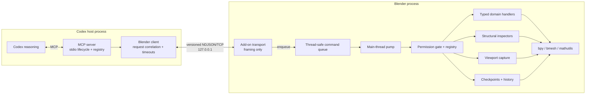
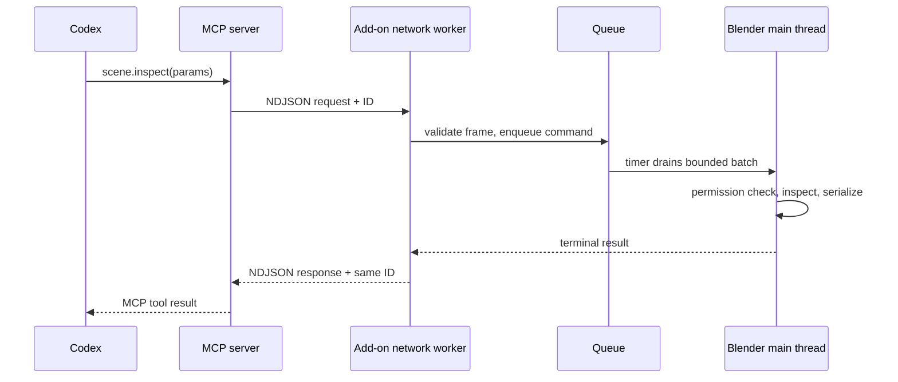

# Architecture

Blender Codex Bridge separates agent reasoning from Blender execution so a language model never receives a raw network path into `bpy`. The system has two processes and one deliberately narrow local protocol.

## Goals

- Give Codex compact structural and visual evidence about the current `.blend`.
- Offer deterministic, typed operations that can be authorized, checkpointed, audited, and verified.
- Keep Blender responsive and confine all Blender API work to its main thread.
- Make domain toolsets independently extensible without changing transport or MCP lifecycle code.
- Default to local, least-privilege operation.

## Non-goals for the MVP

- General remote control of Blender over a network.
- A raw Python, expression, shell, or `bpy` execution API as the normal tool surface.
- Exhaustive serialization of all Blender data or full mesh coordinate dumps.
- Fully autonomous natural-reference resolution, semantic scene memory, or durable project branching.
- Perfect undo across Blender restarts or an alternative to versioned project backups.

## System view



## Component responsibilities

| Component | Owns | Must not own |
| --- | --- | --- |
| Codex | Intent, planning, comparison, refinement, user reporting | Blender sockets, raw `bpy`, permission decisions |
| MCP server | MCP lifecycle, public tool schemas, lazy tool exposure, error translation | Scene mutation, Blender UI state, authoritative permissions |
| Blender client | Loopback connection, IDs, deadlines, serialized writes, response correlation | Tool semantics or Blender state |
| Add-on transport | Listener lifecycle, NDJSON framing, validation before enqueue | `bpy` execution on its worker thread |
| Command queue/pump | Safe cross-thread handoff, bounded main-thread work, terminal response delivery | Public MCP definitions |
| Blender registry/executor | Handler lookup, Blender-side permission check, execution bookkeeping | Socket parsing or agent reasoning |
| Inspectors | Bounded scene, selection, object, mesh, material, and spatial summaries | Mutations disguised as reads |
| Viewport service | Temporary view setup, capture, artifact metadata, state restoration | Numerical truth inferred from pixels |
| Checkpoint/history service | Logical operations, undo integration, concise audit trail | Silent filesystem backup proliferation |
| Domain tools | Typed, focused Blender operations and post-state | Network lifecycle, global permission bypasses |

The separation is a dependency rule, not just a directory preference. The standalone `mcp_server` must import and test without `bpy`; the add-on must not rely on packages installed only in the server's virtual environment.

## Request lifecycle

### Read-only request



Even read-only inspection crosses the main-thread boundary because Blender data can change and many `bpy` reads are not safe from arbitrary worker threads.

### Modifying request

A mutation adds four obligations:

1. Confirm pause/emergency-stop state and required permissions in Blender.
2. Associate the call with a logical operation/checkpoint boundary.
3. Record concise affected-object and outcome history.
4. Return enough post-operation state for Codex to reinspect rather than trust a boolean.

Codex remains responsible for the higher-level checkpoint/act/verify/compare/refine loop. The add-on guarantees the lower-level safety boundary and truthful result/error envelope.

## Threading and responsiveness

The add-on uses at least two execution domains:

- A network worker may accept local connections, read bounded frames, parse generic JSON, wait for completion, and write responses.
- A Blender timer or equivalent callback drains queued commands on Blender's main thread.

Rules:

- No network callback accesses `bpy.context`, data blocks, operators, the dependency graph, or viewport areas.
- Main-thread work is bounded per tick so a burst of requests cannot monopolize the UI indefinitely.
- Socket writes are serialized. Each request gets at most one terminal response.
- Calls may be accepted concurrently, but Blender execution is serial in the MVP. Callers must not assume parallel mutation.
- A timeout is an end-to-end deadline, not proof that an already-running Blender call was rolled back. The queue must reject expired work before it starts; future cancellation work must define safe points for active work.
- Stop/unregister closes listeners, prevents new queue entries, resolves pending requests with a shutdown error, and removes timers.

## State model

The add-on owns session state such as:

- listener lifecycle: stopped, starting, listening, connected, stopping, or error;
- agent control: running, paused, or emergency-stopped;
- current request/task description where available;
- enabled permissions and domain toolsets;
- bounded recent activity;
- checkpoints and logical operations;
- session-scoped selection references.

State that affects authorization or execution lives in Blender, not in the MCP process. UI properties are a view/controller over that state, not a separate policy store.

Emergency stop is stronger than pause: it prevents new mutations and should cause queued mutations that have not started to fail. Neither mechanism should leave a network worker executing Blender code.

## Structural perception

Structural results are JSON-safe, compact, and layered:

- `scene.summary` gives an LLM-oriented collection/object outline and matching structured fields.
- `scene.inspect` gives paginated/bounded object records with hierarchy, collections, transforms, dimensions, bounds, visibility, materials, modifiers, constraints, and applicable statistics.
- `selection.inspect` identifies mode, active/selected objects, and selected edit-mesh component aggregates.
- `object.inspect` adds detailed type-specific information without returning every vertex.

All coordinates and angles must declare a convention when ambiguity is possible. The baseline is Blender world or object-local space as named by the field, metres according to scene units, XYZ vectors, and radians for programmatic rotation fields unless a schema explicitly says degrees.

Results that hit a limit include `truncated: true`, an applicable count/cursor, or an explicit omitted-field note. Codex should narrow the next query rather than assuming the partial result is complete.

### Spatial foundation

Object inspection should keep stable places for world bounding box, center, dimensions, parent/children, collection, visibility, and later nearby-object/camera-distance summaries. Proximity and semantic relationships are derived inspection layers; they are not baked into transport.

### Selection references

A selection reference such as `sel_8f4c2` is an opaque, session-scoped snapshot handle. The design may initially provide only limited persistence. Any topology edit, undo, file load, mode change, or scene switch can invalidate it. Handlers validate the handle against current object/context instead of treating it as a permanent mesh identity.

## Visual perception

`viewport.capture` is evidence acquisition, not an alternate scene database. It may accept view, shading, overlays, resolution, and optional isolation inputs.

A capture transaction is:

1. Find a supported viewport/camera context.
2. Snapshot every setting the operation may temporarily change.
3. Configure view, shading, overlays, isolation, and resolution.
4. Capture to an approved bounded artifact/result representation.
5. Restore state in a `finally` path, including after failure.

Headless Blender, an absent 3D View, unsupported render engines, or unavailable context are explicit errors. The service must not return an old or unrelated image as success.

## Tool registries and lazy toolsets

There are two aligned registries:

- MCP metadata describes the public name, input schema, annotations, and toolset visibility.
- Blender metadata maps the same protocol method to a handler, required permissions, mutation/destructive flags, and history behavior.

The Blender registry is authoritative for execution. Toolset enablement reduces agent context and accidental reach; it does not replace permission checks. Core inspection/recovery tools remain small and always available, while objects, mesh, UV, materials, animation, rigging, camera, lighting, render, and Geometry Nodes can evolve independently.

See [`tool-design.md`](tool-design.md) for the extension contract.

## Permissions and trust boundary

The local TCP boundary is intentionally narrow but is not authenticated against other same-user local processes. Defense therefore includes:

- literal loopback binding;
- no LAN fallback;
- bounded parsing and no dynamic import/eval during dispatch;
- handler allow-listing through a registry;
- immediate Blender-side permission checks;
- dangerous permissions disabled by default;
- sanitized path handling for any future external-file operation;
- no remote shell tool.

MCP visibility, Codex approvals, toolset enablement, and Blender permissions are separate layers. A request proceeds only when every relevant layer allows it. See [`security.md`](security.md).

## Checkpoints, undo, and history

A checkpoint is a logical recovery marker integrated with Blender's undo stack where practical. It is not a hidden `.blend` copy.

Operation history records bounded metadata:

```text
operation ID, tool, affected objects/data, timestamp,
short description, success/failure, checkpoint association
```

Logical operations should match user intent. A repair composed of several internal edits can be one undoable agent step, while unrelated edits should not be merged. A failed operation is recorded truthfully and must not create a success marker.

Undo semantics are session-bound and can be affected by Blender configuration and user edits. Durable branching and named variants belong to later roadmap phases.

## Errors and observability

Public errors are stable, structured, bounded, and actionable. Local logs may include request ID, method, connection lifecycle, queue wait, execution duration, permission denial, checkpoint, and traceback. Normal responses omit giant tracebacks and secrets.

The MCP server maps Blender protocol errors into clear tool failures without converting them to successful text. Its stdout is reserved for MCP stdio framing; logs use stderr or an explicit file.

## Performance boundaries

- Prefer summaries and explicit `include_*` options over eager deep serialization.
- Cap object counts, collection depth, material nodes, diagnostic samples, image resolution, and message size.
- Do not recompute expensive topology diagnostics on every scene summary.
- Cache only data with an explicit invalidation strategy; current Blender state remains authoritative.
- Use viewport captures before full renders when they answer the visual question.
- Keep request deadlines and queue-wait time observable.

## Extension seams

Future localized topology inspection, automated diagnostics, multi-angle capture, semantic scene references, visual feedback evaluators, and project variants should be implemented as services/handlers behind the same registry and execution boundary. None require MCP to import Blender or transport to understand domain semantics.

This is the central architectural test: adding a complete `rigging` or `geometry_nodes` toolset should require schemas, handlers, permissions, tests, and documentation—not a rewrite of the socket, command queue, or MCP lifecycle.
