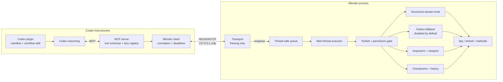
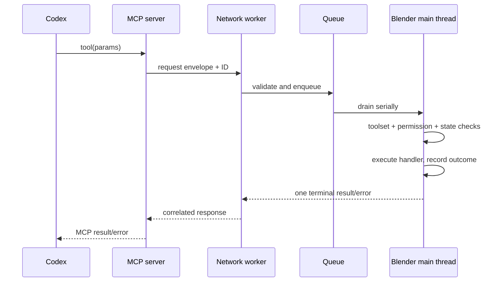

# Architecture

Blender Codex Bridge separates agent reasoning from Blender execution. Codex receives typed MCP tools; a local adapter forwards versioned requests; Blender remains the authority for toolset state, permissions, main-thread execution, undo, history, and live project state.

## Goals and non-goals

Goals:

- provide compact structural and visual evidence from the current `.blend`;
- make common edits typed, bounded, permissioned, recoverable, and verifiable;
- keep every Blender API call on Blender's main thread;
- add domains without changing transport or MCP lifecycle code;
- keep local operation visible and controllable in Blender.

Version 0.2.0 does not aim to serialize all Blender data, automate every editor with a dedicated tool, infer ambiguous scene references, provide durable project branching, or support remote/LAN deployment. `python.execute` is the explicitly armed long-tail coverage layer for ordinary `bpy`/`bmesh`/`mathutils` operations without structured handlers, but Python is not the normal tool surface and the project never exposes a remote shell.

## System view



## Component boundaries

| Component | Owns | Must not own |
| --- | --- | --- |
| Codex | Intent, plans, comparison, refinement, reporting | Blender authorization or direct `bpy` access |
| Codex plugin | MCP launch configuration and Blender workflow skill | Python runtime, Blender data, or permission state |
| MCP server | MCP lifecycle, public schemas, annotations, lazy toolsets, error translation | Scene mutation or authoritative permissions |
| Blender client | Loopback connection, IDs, deadlines, serialized writes, correlation | Blender semantics |
| Add-on transport | Listener lifecycle, frame bounds, generic envelope validation | Any Blender API call on its worker threads |
| Queue/executor | Cross-thread handoff, deadline-before-start, serial main-thread dispatch | MCP schemas or socket framing |
| Blender registry | Handler lookup, toolset gate, live permission gate, mutation metadata | Agent reasoning |
| Inspectors/viewport | Bounded structural and visual evidence | Mutations disguised as reads or measurements inferred from pixels |
| Checkpoints/history | Logical undo boundaries and bounded audit records | Durable branching or hidden backup-file creation |
| Structured domains | Typed Blender operations and post-state | Network lifecycle or permission bypass |
| Python fallback | Acknowledged long-tail scripts with accident-prevention controls | Normal composition, a security sandbox, or shell/network tooling |

The standalone `mcp_server` imports without `bpy`. The add-on uses only Blender's bundled Python and standard-library dependencies.

## Request lifecycle



Even reads cross the main-thread boundary. A modifying request also checks pause/emergency-stop state, participates in logical checkpoint/history behavior, identifies affected data where practical, and returns post-operation state. Codex still performs the higher-level inspect/checkpoint/act/verify/compare/refine loop.

## Threading, ordering, and timeouts

- Network workers may accept connections, frame bounded JSON, enqueue work, and write responses. They never access `bpy`.
- A Blender timer drains commands on the main thread. Execution is serial, even if transport requests are in flight concurrently.
- Socket writes are serialized and one accepted request gets at most one terminal response.
- Stop/unregister closes listeners, prevents new enqueues, rejects queued work, closes active sockets, and removes timers.
- Expired work is rejected before it starts. A caller timeout cannot safely interrupt every already-running Blender API call, so a post-send timeout/disconnect has an unknown outcome until history and state are reinspected.
- `python.execute` has an additional cooperative trace deadline. Long-running Blender C operations cannot always be preempted.

Dependent mutations must be issued sequentially and verified between calls.

## State and Blender sidebar

Blender owns session state for listener/client lifecycle, pause and emergency stop, the current method, the high-level task, queue/activity status, toolsets, permissions, history, checkpoints, and session-scoped selection references. `bridge.task.set` and `bridge.task.clear` update the task shown in the sidebar.

The 3D View sidebar is a view/controller over that state. It presents:

- status, protocol/add-on version, connected clients, current tool, and queue depth;
- host, port, and timeout configuration;
- start/stop, pause/resume, and emergency stop;
- current task and last error;
- every toolset and its tool count, including bulk structured/core-only controls;
- live Blender-side permission toggles;
- bounded operation history, affected objects, duration, diagnostics copy/clear;
- local checkpoint, one-step global undo, and checkpoint restore actions.

Emergency stop is stronger than pause: pause blocks mutations but leaves inspection available; emergency stop also stops the listener and cancels queued/not-started work. Neither can roll back an operation that already completed.

## Structural and visual evidence

Structural results are compact and layered:

- `scene.summary` gives an LLM-oriented overview plus structured fields;
- `scene.inspect` returns bounded object/hierarchy/collection state;
- `selection.inspect` records object or edit-mesh context and issues session-scoped selection IDs where applicable;
- `object.inspect` and domain inspectors return bounded type-specific detail.

Numeric Blender state is authoritative for transforms, dimensions, counts, frames, topology, UV bounds, node values, and rig state. Results that hit a limit report truncation or omitted counts. A selection ID must be reinspected after topology edits, undo, mode changes, file loads, scene switches, or other invalidating state.

`viewport.capture` and `render.execute` provide visual evidence. They snapshot and restore temporary view/render settings on a best-effort basis and report artifact metadata. Captures and renders replace Blender's session **Render Result**. Images support judgments about silhouette, composition, shading, lighting, and appearance; they are not numerical measurements.

## Registries and current toolsets

There are two aligned registries:

- MCP metadata owns names, public wrappers, descriptions, annotations, and lazy exposure.
- Blender metadata maps the same methods to handlers, permissions, toolsets, mutation behavior, checkpoint policy, and local/remote availability.

Blender is authoritative. Toolset enablement narrows reach and MCP schema load but never grants a permission.

Version 0.2.0 registers **89 add-on methods** and **88 MCP tools**. `checkpoint.restore_last` is local-UI-only. Core has 16 MCP tools. Optional toolsets are:

```text
objects       mesh          materials     nodes
uv            modifiers     constraints   animation
rigging       scene_edit    render        python
```

Structured coverage includes primitive objects, arbitrary meshes from bounded topology arrays, selection-scoped modeling/transforms, material lifecycle and shader nodes, UVs, modifiers, object constraints, animation, armatures and pose, scene/collections/camera/light/world, render, viewport evidence, save, and checkpoints. It does not imply a structured handler for every Blender operation. Geometry Nodes graph editing, compositor editing, simulation/bake workflows, sculpt/paint, NLA, advanced weighting, retopology, and other specialist work remain extension areas.

## Python exception path

`python.execute` is the deliberate exception to both the normal no-code input rule and the normal structured domain permission model. It requires:

- explicit enablement of the `python` toolset;
- all four high-risk Blender permissions: `EXECUTE_PYTHON`, `DELETE_OBJECTS`, `ACCESS_EXTERNAL_FILES`, and `SAVE_PROJECT`;
- `confirm_dangerous=true` and a non-empty `expected_effect` on every call;
- code, AST, input, safe-import, cooperative-deadline, 64 KiB stdout, and bounded result validation (4,000 items, depth 8, 4,000 integer digits, no cyclic/shared expansion, 256 KiB serialized).

The namespace exposes `bpy`, JSON-safe `inputs`, bounded `print`, and a JSON-safe `result`. Allowed import roots are `bpy`, `bmesh`, `mathutils`, `math`, `json`, `collections`, `functools`, `itertools`, `random`, and `statistics`. Result conversion enforces a global 4,000-item budget, depth 8, a 4,000-digit integer guard, cyclic/shared-reference rejection, and a 256 KiB serialized cap before transport. Exceeding a graph/scalar/byte limit—or encountering an unexpected post-execution conversion/size-check failure—produces explicit `__truncated__` metadata marked with `result_truncated` and `result_limit_bytes`, preserving the surrounding audit/recovery response. Stdout remains independently capped at 64 KiB. The policy rejects obvious filesystem/process/network/dynamic-code/introspection paths, but it is not a security sandbox. Once armed, raw `bpy` can bypass the ordinary structured `EDIT_*` gates, delete project data, use Blender file APIs, and save. Requiring all four broad permissions makes that authority explicit.

Success always marks verification as required. A script that starts and then fails returns bounded digest/effect/output/delta evidence with `mutation_outcome_unknown: true` and `verification_required: true`. The executor records it as a possible mutation and finalizes the pre-created undo boundary so the user has a tracked recovery step.

## Permissions and trust boundary

The listener is local but unauthenticated against other same-user processes. Defense in depth includes literal loopback binding, a 4 MiB frame cap, a bounded queue, exact registered dispatch, live toolset and permission checks, main-thread serialization, bounded results, dangerous defaults, explicit path controls, audit history, pause/stop controls, and no remote shell.

Permissions are listed in [tool design](tool-design.md) and the full threat model is in [security](security.md).

## Checkpoints and history

A logical checkpoint integrates with Blender's global session undo. It is not a hidden `.blend` copy. History records bounded operation/tool identity, affected data, timing, success/failure, and checkpoint association. Blender does not expose reliable undo-entry ownership, so remote global undo requires `confirm_global_undo=true`; local undo/restore uses confirmation dialogs and may affect interleaved user work.

## Performance and extension rules

- Prefer bounded summaries and pagination over eager deep serialization.
- Cap object counts, collection depth, mesh diagnostics, node graphs, UV islands, bones, curves, images, code, and messages.
- Prefer direct data APIs and `bmesh`; establish and restore context around unavoidable operators.
- Use structured tools before Python and viewport evidence before a full render when sufficient.
- Cache only with an explicit invalidation strategy; current Blender state wins.
- Add a new domain through schemas/wrappers, Blender handlers/metadata, permissions, tests, and documentation—not by changing transport into a generic dispatcher.

Geometry Nodes and compositor support should fit behind these seams without making the MCP process import Blender or making network code understand node semantics.
