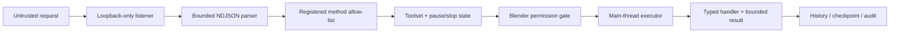

# Security model

Blender Codex Bridge is a local automation boundary around a powerful desktop application. A permitted Blender action can alter or delete project data, save files, trigger expensive computation, or expose scene contents. Security therefore depends on local-only transport, Blender-side least privilege, strict registered dispatch, bounded inputs, and visible recovery controls.

## Supported deployment

The supported V1 deployment is:

- Blender and the MCP server run on the same trusted workstation and normally as the same user.
- Blender listens on the literal IPv4 loopback address `127.0.0.1`.
- Codex launches the MCP server locally over stdio.
- The add-on UI is visible to the Blender user, who controls permissions and bridge lifecycle.

Remote use, LAN binding, port forwarding, reverse proxies, container-published ports, tunnels, and unattended multi-user service hosting are outside the security model.

## Assets to protect

- The open `.blend` and linked/appended project data.
- Unsaved user work and Blender's undo history.
- Files accessible to the Blender process.
- Scene contents, names, images, texture paths, and rendered/viewport artifacts.
- Workstation availability: expensive geometry operations or renders can consume CPU, GPU, RAM, and UI time.
- Local logs, which may reveal object names, file paths, or operation context.
- User intent and control over what is modified or saved.

## Trust assumptions

Trusted:

- The installed add-on and MCP-server code from this repository/release.
- Blender and its Python runtime.
- The local user operating Blender and approving permissions.

Not automatically trusted:

- Tool arguments generated by an agent.
- TCP frames, even from loopback.
- Other processes running under the same OS account.
- Object names, node labels, file paths, and custom properties inside an untrusted `.blend`.
- MCP-visible metadata as a substitute for Blender authorization.

Loopback prevents direct connections from remote network hosts, but it does not authenticate peer processes on the same machine. Another local process may be able to connect to an open port. Close or pause the bridge when it is not in use, and do not run untrusted local software alongside a writable session.

## Layered controls



No one layer replaces another.

### Local-only listener

- Accept only the configured literal `127.0.0.1` host in V1.
- Fail closed if binding or host validation fails; never broaden to all interfaces.
- Use a finite frame size, finite pending queue, socket timeouts, and clean shutdown.
- Treat malformed/oversized input as a protocol error; do not allocate indefinitely.

### Registered dispatch

Only exact registered method names can execute. Dispatch must not use `eval`, `exec`, arbitrary module imports, reflective dotted attribute traversal, shell interpolation, or raw Blender operator names from the request.

Unknown methods return `METHOD_NOT_FOUND`. Recognized but unfinished behavior returns `NOT_IMPLEMENTED`.

### Main-thread execution

Socket workers never access or mutate Blender data. They enqueue bounded commands. The main-thread executor rechecks current policy immediately before the handler runs, preventing a queued request from relying on stale permission state.

This is both a correctness and security boundary: it limits race-driven context corruption and keeps audit/checkpoint decisions around the actual mutation.

### Blender-side permissions

Permissions are capabilities, not UI decoration:

```text
INSPECT_SCENE, CAPTURE_VIEWPORT, TRANSFORM_OBJECTS,
EDIT_MESH, EDIT_MATERIALS, EDIT_ANIMATION,
DELETE_OBJECTS, EXECUTE_PYTHON, ACCESS_EXTERNAL_FILES,
SAVE_PROJECT
```

Rules:

- A handler declares all required permissions in Blender's registry.
- The executor checks them immediately before execution.
- Missing permission means no handler invocation and a bounded `PERMISSION_DENIED` error.
- Toolset enablement narrows availability but does not grant permission.
- MCP client approvals are an additional user-control layer, not a replacement.
- Deletion, arbitrary Python, and external file access remain off by default.

### Pause and emergency stop

Pause blocks new mutating work while permitting enough status/control inspection to recover. Emergency stop rejects queued/not-started mutations and prevents new ones until explicitly cleared. Neither can safely interrupt arbitrary Blender code halfway through; handlers must remain short or implement cooperative safe points.

Stopping the bridge closes listeners and resolves pending work. Users should use Blender's own process controls if Blender itself is unresponsive.

## Arbitrary Python and shell access

Structured tools are the normal interface. A future `python.execute` fallback, if shipped:

- is disabled by default and visually labeled dangerous;
- requires `EXECUTE_PYTHON` checked in Blender;
- accepts no implicit shell mode;
- captures bounded stdout/error details;
- cannot bypass other explicit path/project policy by convention;
- is never used internally to implement ordinary tool calls.

The project must not expose remote shell execution. Adding a generic shell tool would materially change the threat model and is not a normal roadmap extension.

Python execution inside Blender is effectively code execution with the user's Blender privileges. Enable it only for code you would run manually and disable it immediately afterward.

## Filesystem and saving

Reading or writing a user-chosen external path requires `ACCESS_EXTERNAL_FILES` in addition to the domain permission. Saving the current project requires `SAVE_PROJECT`; saving to a new/external path may require both.

Path-handling requirements:

- Normalize and resolve paths in Blender before use.
- Reject traversal, device paths, unexpected schemes, shell fragments, and unsupported network paths according to the tool's policy.
- Do not expand environment variables or home shortcuts implicitly.
- Constrain temporary capture artifacts to a controlled directory with unpredictable names and explicit cleanup behavior.
- Avoid overwriting existing files unless the method explicitly supports it and the user intent is clear.
- Do not create silent `.blend` copies for checkpoints.

File extension checks are not sufficient security; use resolved path policy and explicit permission.

## Project data as untrusted input

Object/material/node names, custom properties, text blocks, linked paths, and metadata can contain adversarial or malformed content. The bridge should:

- serialize them as data, never code or format strings;
- bound length and nesting;
- avoid automatically following linked file paths;
- avoid placing unescaped values into shell commands, logs with control sequences, or HTML;
- sanitize capture/artifact filenames instead of using object names directly.

A `.blend` can also contain Blender handlers/scripts independent of this bridge. Use Blender's trusted-source and auto-run settings appropriately when opening untrusted files.

## Denial-of-service resistance

Local input can still exhaust resources. Controls include:

- 4 MiB maximum NDJSON frame in the current transport;
- a bounded command queue (256 pending commands in the current transport);
- bounded strings, arrays, object pages, mesh diagnostics, node traversal, and image resolution;
- finite connect/read/tool deadlines;
- bounded main-thread work per timer tick;
- no full-quality render when a viewport capture satisfies the request;
- no default full-mesh coordinate serialization;
- concise UI history and bounded local logging.

Limits should be configurable only within safe caps. Hitting a limit returns explicit truncation or a structured error.

## Viewport capture and data exposure

A capture may reveal scene content, reference images, object names, overlays, or other visible workspace information. `CAPTURE_VIEWPORT` is separate from scene inspection for this reason.

Capture tools must:

- target only the requested local Blender context;
- bound resolution and output size;
- cap preview render sampling and restore the user's sampling settings;
- avoid including overlays unless requested/allowed;
- restore temporary visibility, selection, view, and shading state;
- return explicit artifact metadata;
- report that Blender's Render Result buffer is replaced by the capture operator;
- avoid writing outside controlled locations without external-file permission.

`CAPTURE_VIEWPORT` is consent to both the managed temporary PNG and replacement of the session's Render Result. The bridge restores render configuration and region/crop settings, but Blender does not provide a bounded, reliable way to restore an arbitrary prior render buffer.

## Logs and error responses

Local logs may contain request IDs, methods, durations, concise object names, permission denials, checkpoints, and full tracebacks for debugging. They should not contain secrets, entire scene dumps, raw image data, environment inventories, or unlimited user-controlled strings.

MCP/protocol errors return stable codes, safe messages, bounded context, and optionally a diagnostic ID. They do not expose unrestricted tracebacks. MCP stdio stdout is protocol-only; diagnostics use stderr or an explicit local log.

## Checkpoints are not backups

Blender undo state is global, in-memory/session-sensitive, and can be changed by user actions, configuration, file loads, and some operations. Blender exposes no reliable undo-entry ownership. The bridge requires explicit risk confirmation before global undo and reports that scope, but it cannot guarantee agent-only rollback when user work is interleaved. Operation history is an audit aid, not immutable provenance. Keep normal versioned backups for important work and test risky tools on copies.

## Security checklist for releases

- Confirm listener rejects every non-literal-loopback host.
- Confirm no `bpy` call runs from network threads.
- Enumerate registered handlers and review their permissions/mutation flags.
- Exercise denial for every modifying/destructive permission.
- Fuzz malformed, partial, oversized, deeply nested, and duplicate-ID frames.
- Verify MCP stdout contains no log output.
- Search for dynamic `eval`, `exec`, shell/subprocess, unsafe deserialization, and unbounded reads.
- Test path normalization/overwrite behavior for every file-accepting tool.
- Verify pause, emergency stop, timeout-before-start, disconnect, and unregister cleanup.
- Confirm capture state restoration on success and injected failure.
- Review logs/errors for sensitive or unbounded content.

## Reporting a vulnerability

Do not include sensitive `.blend` files, tokens, private paths, or exploit details in a public issue. Contact the repository maintainers privately through the security-reporting mechanism configured for the GitHub repository. If no private channel is configured, open a minimal issue asking for a private contact without publishing exploitation steps.
